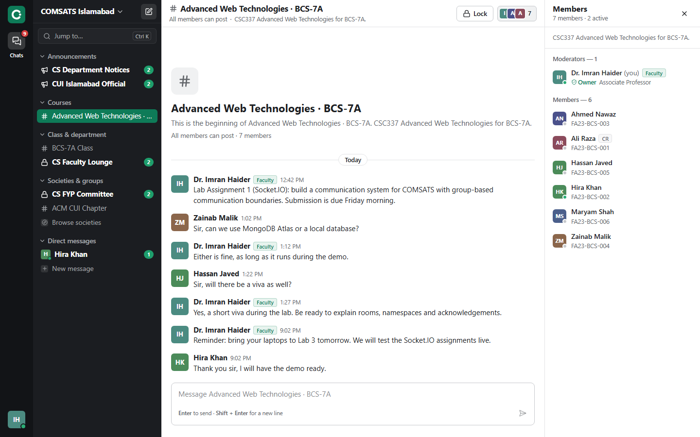
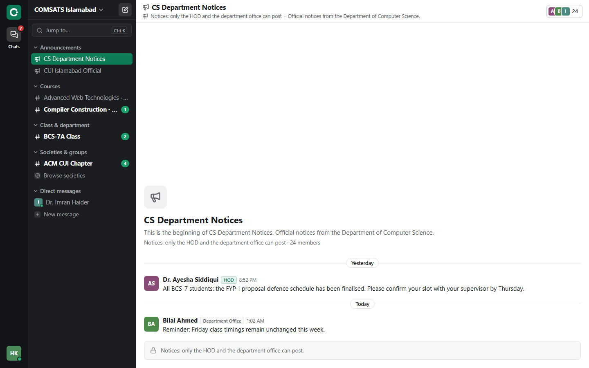
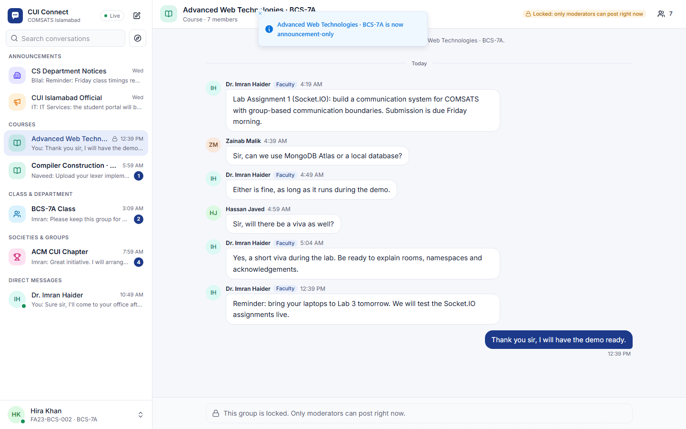
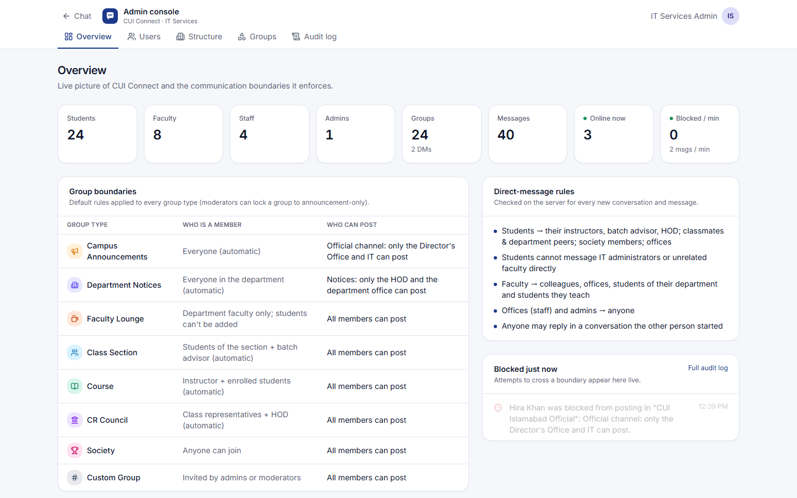
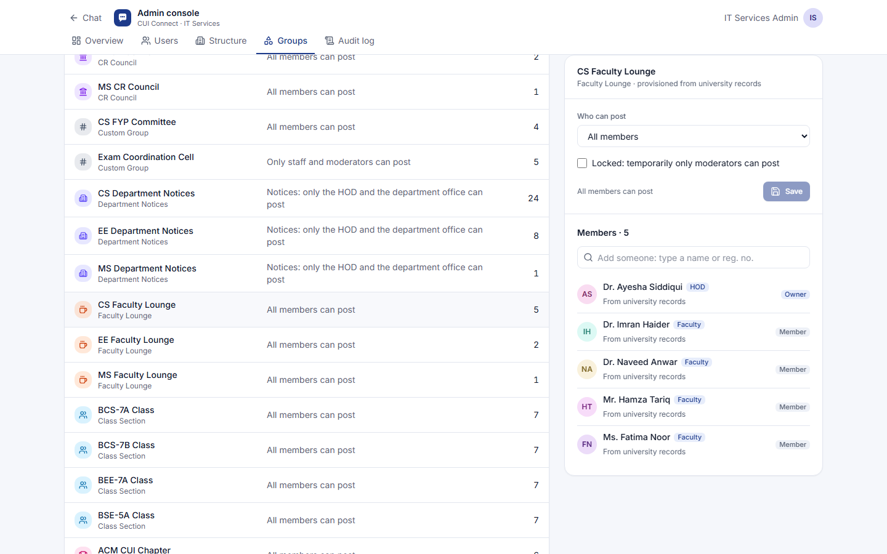
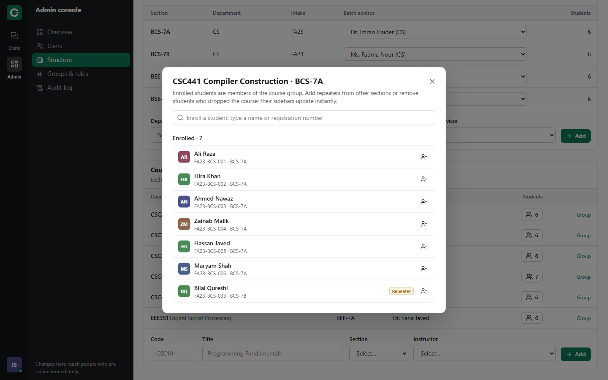
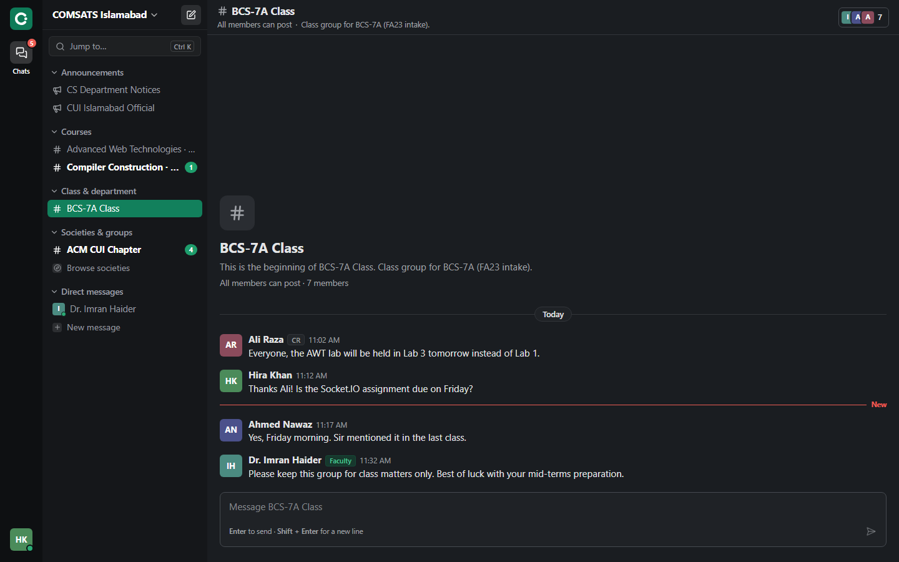

# CUI Connect

**Real-time communication system for COMSATS University Islamabad, built with Socket.IO.**

*Lab Assignment 1 (CLO-5) · Advanced Web Technologies*

The university's structure (departments, sections, course offerings, offices) creates the groups. A server-side policy engine enforces **communication boundaries**: who can post in which group, who can join it, who can moderate it, and who can message whom directly. Every boundary is checked on the server for every Socket.IO event and REST call, and the UI explains each rule to the user.



## Contents

- [Features](#features)
- [Quick start](#quick-start)
- [Demo accounts](#demo-accounts)
- [Deploy (one permanent link)](#deploy-one-permanent-link)
- [Start from scratch](#start-from-scratch-your-own-campus)
- [Communication boundaries](#communication-boundaries)
- [Tech stack](#tech-stack)
- [Project structure](#project-structure)
- [Scripts](#scripts)
- [Testing](#testing)
- [Configuration](#configuration)
- [Troubleshooting](#troubleshooting)
- [Architecture & Socket.IO design →](docs/ARCHITECTURE.md)

## Features

**Realistic COMSATS model**
- Roles:
  - **Admin**: IT Services.
  - **Faculty**: with HOD and batch-advisor duties.
  - **Staff**: Director's Office, Examination Office, Student Affairs, department office.
  - **Student**: registration numbers like `FA23-BCS-001`; class representatives (CRs) are flagged.
- Structure: departments → sections (e.g. `BCS-7A`) → course offerings, with batch advisors and enrollments. Repeaters can be enrolled from another section.
- Groups provisioned automatically from that structure:
  - Campus announcements.
  - Department notices.
  - Faculty lounges.
  - Class sections.
  - Course groups.
  - CR councils.
- Voluntary **societies** and invite-only **custom groups** (e.g. an FYP committee, or an Exam Coordination Cell where only the Examination Office posts).

**Communication boundaries**
- Announcement channels: only moderators post (Director's Office and IT for the campus; HOD and department office for a department).
- Membership eligibility: students can never be added to a faculty lounge, other sections' groups, or courses they aren't enrolled in.
- Moderation: instructors and batch advisors can lock a group to announcement-only, mute members and delete messages.
- DM rules: students can message their instructors, batch advisor and HOD, but not unrelated faculty or IT admins. The reply rule lets them answer anyone who messages them first.
- Every blocked attempt is audited (without the message text) and streamed live to admins.

**Real-time (Socket.IO)**
- Rooms per group and per user.
- Typed events with acknowledgements.
- Optimistic sending with idempotent retries.
- Typing indicators, presence, unread counts, read receipts ("Seen").
- Live membership changes: a sidebar updates the moment an admin adds or removes someone.
- Instant session revocation on deactivation.
- Connection-state recovery after brief drops.
- An `/admin` namespace for live stats and the audit feed.

**Workspace UI**
- A Slack-style layout: an app rail, a dark sidebar with collapsible sections (Announcements, Courses, Class & department, Societies & groups, Direct messages) and unread counts.
- **Ctrl/⌘ + K** quick switcher to jump to any conversation from the keyboard.
- An **Unreads** home page that lists conversations with new messages and a preview of the latest one.
- Flat message rows with a hover toolbar, a red **"New"** divider at the first unread message, and an intro at the top of each conversation ("This is the beginning of …").
- The channel header states who can post; when posting isn't allowed, the composer explains why.
- Members panel with moderation (mute 15 min / 1 h / 1 day, change role, remove).
- Emerald theme with light, dark and match-system appearance; works on phones.

**Admin console**
- Users: create, CSV bulk import, edit details, CR/HOD flags, password reset, deactivation.
  - Moving a student to another section swaps their class group live.
- University structure: departments, sections with batch advisors, course offerings.
  - Course enrollment manager: enroll repeaters from other sections or remove students; the course group appears or disappears in their sidebar instantly.
- Group policy editor with members.
- Live audit log.

| Read-only announcement channel | Course locked by the instructor |
|---|---|
|  |  |

| Admin overview: live stats and blocked attempts | Group policy editor |
|---|---|
|  |  |

| Course enrollment with a repeater | Dark mode |
|---|---|
|  |  |

## Quick start

**Requirements:** Node.js 22.12+ (developed on Node 24) and npm. MongoDB is **optional**.

```bash
npm install
npm run dev
```

Open **http://localhost:5173** and click any demo account.

- `npm run dev` starts three processes: an embedded MongoDB, the API + Socket.IO server (port 4000) and the Vite dev server (port 5173). The web server waits until the API is ready.
- The first start seeds the demo campus automatically.
- To use your own MongoDB (local or Atlas), set `MONGODB_URI` in `.env`; see [Configuration](#configuration).

**Production mode** runs the UI, API and Socket.IO on a single port:

```bash
npm run build
npm start
```

Then open http://localhost:4000.

**People in other cities** (free, no hosting account): install Cloudflare's tunnel tool once, then share a public `https://` link to this computer.

```bash
winget install --id Cloudflare.cloudflared
```
```bash
npm run build
```
```bash
npm run share
```

`npm run share` starts the production server and a [Cloudflare quick tunnel](https://developers.cloudflare.com/cloudflare-one/connections/connect-networks/do-more-with-tunnels/trycloudflare/) and prints a link like `https://random-words.trycloudflare.com`. Anyone with the link can open the sign-in page; each person signs in with their own account. The link works while the window stays open and the computer is online and awake, and it changes every time you run the command. Sessions opened through the tunnel get an HTTPS-only cookie automatically.

**Two people at once:** each browser keeps one session, so open a second **private/incognito window**, or a different browser, to sign in as someone else. In production mode, `http://localhost:4000` and `http://127.0.0.1:4000` also count as separate sites.

## Demo accounts

The password for every account is **`Comsats@2026`**. Students can sign in with their registration number.

| Person | Sign in with | Try this |
|---|---|---|
| IT Services Admin | `admin@comsats.edu.pk` | Admin console: live audit feed, enroll a repeater (Structure), add a student to the faculty lounge (refused) |
| Director's Office (staff) | `director.office@comsats.edu.pk` | Post in *CUI Islamabad Official* |
| Dr. Ayesha Siddiqui (HOD CS) | `ayesha.siddiqui@comsats.edu.pk` | Post CS notices; owns the CS faculty lounge and CR council |
| Dr. Imran Haider (faculty) | `imran.haider@comsats.edu.pk` | Lock/unlock the AWT course; mute a student in BCS-7A |
| Ali Raza (BCS-7A, CR) | `FA23-BCS-001` | Member of the CR council and the Exam Coordination Cell |
| Hira Khan (BCS-7A) | `FA23-BCS-002` | Read-only in notices; *New message* lists only allowed people |
| Usman Tariq (BCS-7B, CR) | `FA23-BCS-031` | Can't see any BCS-7A conversation |
| Examination Office (staff) | `exam.office@comsats.edu.pk` | Can message anyone; posts in the Exam Coordination Cell |

All 37 accounts are defined in [`apps/server/src/seed/data.ts`](apps/server/src/seed/data.ts). Run `npm run seed` to reset the demo data at any time.

## Deploy (one permanent link)

The app is one Node.js process (UI + API + Socket.IO), so it needs a host that keeps a server running. [`render.yaml`](render.yaml) deploys it to **Render** (free) with a free **MongoDB Atlas** database. Vercel's functions are a poor fit: on the free plan connections end after 5 minutes, and live messages don't reach people connected to a different instance.

1. **MongoDB Atlas:** create a free cluster, a database user, allow access from anywhere (`0.0.0.0/0`, as Render's free tier has no fixed IP), and copy the connection string.
2. **Render:** *New → Blueprint*, pick this GitHub repository, then fill in the two values it asks for: `MONGODB_URI` (the Atlas string) and `SETUP_CODE` (any secret phrase).
3. Open the `https://….onrender.com` link. The **Set up CUI Connect** page asks for the setup code and creates your administrator; the admin console then shows a five-step checklist (departments → faculty and staff → sections → students → courses).

Everyone signs in with the account the admin creates for them and can change their password from the account menu. The free service sleeps after 15 minutes without visitors; the next visit wakes it in about a minute. The site starts empty: no demo data and no demo accounts.

## Start from scratch (your own campus)

Stop the app, then run:

```bash
npm run setup
```

It asks you to type `DELETE`, then for the administrator's name, email and password (the password is hidden as you type). It deletes **every** user, group and message and leaves an empty campus: the *CUI Islamabad Official* channel and your admin account. The login page stops listing demo accounts. Run `npm run seed` to go back to the demo campus.

Sign in as the admin and build the campus in this order (each step needs the one before it):

1. **Structure → Departments** (e.g. CS). Each gets a notices channel, a faculty lounge and a CR council.
2. **Users → Add user: faculty and staff.** Faculty need a department (tick *HOD* for the head); staff need an office.
3. **Structure → Sections** (e.g. BCS-7A) with a batch advisor. Each gets a class group.
4. **Users → Add user: students** in their section (tick *CR* for class representatives), or **Import CSV**.
5. **Structure → Courses** with a section and instructor. Everyone in the section is enrolled automatically; add repeaters with the enrollment manager.
6. Optional: societies and custom groups under **Groups & rules**.

For scripts: `SETUP_ADMIN_NAME`, `SETUP_ADMIN_EMAIL` and `SETUP_ADMIN_PASSWORD` in the environment plus `npm run setup -- --yes` skip the questions.

## Communication boundaries

| Group | Who is a member | Who can post |
|---|---|---|
| Campus announcements | Everyone (automatic) | Director's Office and IT (moderators) |
| Department notices | Everyone in the department (automatic) | HOD and department office (moderators) |
| Faculty lounge | Department faculty only | All members |
| Class section | Section students + batch advisor (automatic) | All members (advisor moderates) |
| Course | Instructor + enrolled students (automatic) | All members; instructor can lock to announcement-only |
| CR council | Class representatives + HOD (automatic) | All members |
| Society | Anyone who joins | All members (configurable) |
| Custom group | Invited people (optionally limited by role) | Configurable: everyone / moderators / chosen roles |

**Direct messages**

| Sender | Can start a conversation with |
|---|---|
| Student | Their instructors, batch advisor and HOD; students in their department or a shared group; any office (staff). **Not** IT admins or unrelated faculty |
| Faculty | Colleagues, admins, offices, students of their department or students they teach |
| Staff / Admin | Anyone |
| Anyone | Can reply in a conversation the other person started |

The rules live in one pure, fully unit-tested module, [`packages/shared/src/policy.ts`](packages/shared/src/policy.ts):
- The server enforces it.
- The browser uses the same code only to explain disabled actions.

[docs/ARCHITECTURE.md](docs/ARCHITECTURE.md) has the full design: diagrams, rooms, the event list and the data model.

## Tech stack

| Layer | Choice |
|---|---|
| Real-time | **Socket.IO 4.8**: typed events, rooms, namespaces, acknowledgements, connection-state recovery |
| Server | Node.js 24, **Express 5**, TypeScript 7, Zod 4, pino, helmet, express-rate-limit |
| Database | **MongoDB + Mongoose 9**; an embedded `mongod` (mongodb-memory-server) when no URI is set |
| Auth | httpOnly SameSite cookie with a JWT (jose); **argon2id** password hashing |
| Web | **React 19**, Vite 8, React Router 8, Tailwind CSS 4, Radix UI, TanStack Query 5, Zustand 5 |
| Quality | Vitest 5 (unit + multi-client integration), Playwright (multi-user E2E), Biome 2 |

## Project structure

```
├─ packages/shared/     # Shared by server and web: policy engine, Zod schemas, DTOs, typed Socket.IO events
├─ apps/server/         # Express + Socket.IO + Mongoose
│  ├─ src/realtime/     # Socket auth, rooms, event handlers, presence, /admin namespace
│  ├─ src/services/     # Provisioning, messages, DMs, moderation, users, structure, audit
│  ├─ src/http/         # REST API (auth, groups, admin)
│  ├─ src/models/       # Mongoose models
│  ├─ src/seed/         # Demo COMSATS campus
│  └─ test/             # Integration tests with real Socket.IO clients
├─ apps/web/            # React app (chat + admin console)
├─ e2e/                 # Playwright tests (several users in separate browser contexts)
└─ docs/                # Architecture notes and screenshots
```

## Scripts

| Command | What it does |
|---|---|
| `npm run dev` | Embedded MongoDB + API (watch mode) + Vite dev server |
| `npm run build` | Builds the web app and bundles the server |
| `npm start` | Runs the production server (UI + API + Socket.IO on port 4000) |
| `npm run share` | Production server + a public Cloudflare quick-tunnel link (needs `cloudflared`) |
| `npm run seed` | Resets the database and loads the demo campus |
| `npm run setup` | Deletes everything and creates an empty campus with your own admin |
| `npm test` | Unit tests (policy engine) + server integration tests |
| `npm run e2e` | Builds, then runs the Playwright end-to-end tests |
| `npm run typecheck` | TypeScript checks for all workspaces |
| `npm run lint` / `npm run format` | Biome lint / auto-format |

## Testing

```bash
npm test        # 123 tests: policy matrix + Socket.IO integration
npm run e2e     # 9 browser tests with several people at once
```

- **Policy unit tests:** every role × group type × action, all DM rules.
- **Integration tests:** spin up the real server against an in-memory MongoDB and connect several authenticated `socket.io-client`s. They prove that:
  - forbidden posts are rejected and never reach anyone;
  - rooms are isolated between sections;
  - lock, mute and delete work;
  - added members join instantly and removed members stop receiving immediately;
  - DM rules and the reply rule hold;
  - rate limiting and payload validation work;
  - idempotent retries store one message;
  - typing, presence and read receipts reach only the right people;
  - deactivation disconnects live sockets;
  - only admins can join `/admin`.
- **End-to-end tests:** run the production build in Chromium with separate browser contexts (different people). Examples:
  - an instructor locks a course and the student's composer switches to read-only instantly;
  - an admin adds a student to a society and it appears in their sidebar live;
  - an admin enrolls a repeater from another section, or moves a student to another section, and the student's sidebar changes live;
  - scrolling up loads older messages page by page.

## Configuration

Everything works without a `.env` file. To customise, copy `.env.example` to `.env`. The most useful settings:

| Variable | Default | Purpose |
|---|---|---|
| `MONGODB_URI` | *(empty)* | Use your own MongoDB (local or Atlas) instead of the embedded one |
| `API_PORT` | `4000` | API + Socket.IO port |
| `JWT_SECRET` | *(generated)* | Session signing key; auto-generated into `.data/` if empty |
| `AUTO_SEED` | `true` | Seed demo data when the database is empty |
| `DEMO_MODE` | `true` | Show demo accounts on the login screen |
| `COOKIE_SECURE` | `false` | Set `true` behind HTTPS |
| `SETUP_CODE` | *(empty)* | Code the first-run setup page asks for before creating the first admin |
| `TRUST_PROXY` | `loopback` | Proxy hops to trust for client IPs (`1` behind a host's load balancer) |

## Troubleshooting

- **The first `npm install` or `npm run dev` is slow.**
  - Without `MONGODB_URI`, the MongoDB server binary is downloaded once (a few hundred MB on Windows) and cached in `node_modules/.cache`.
  - Set `MONGODB_URI` to skip the download.
- **Port in use.**
  - Change `API_PORT`, and `EMBEDDED_MONGO_PORT` if 27019 is taken.
  - The Vite port is fixed at 5173 in `apps/web/vite.config.ts`.
- **Start over with fresh demo data.** Run `npm run seed`, or stop the app and delete the `.data/` folder.
