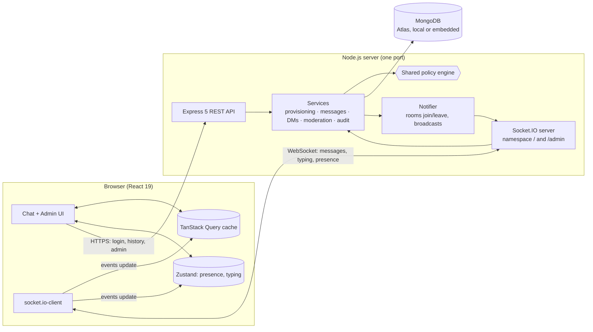
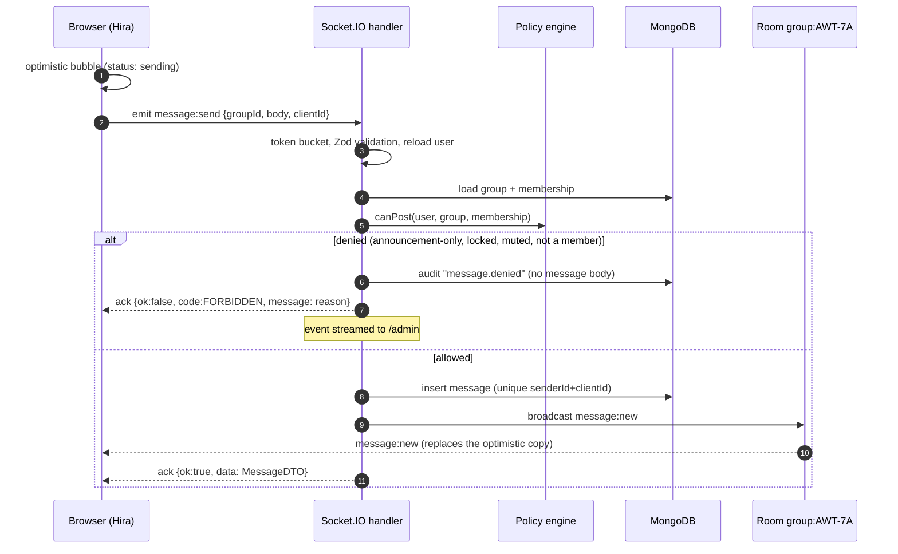
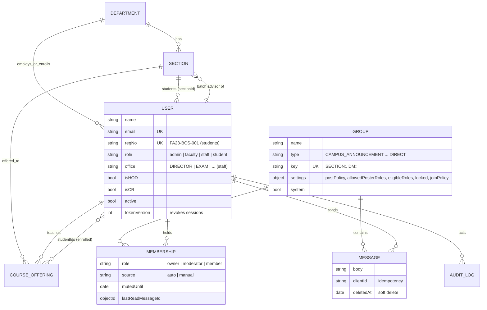

# CUI Connect: architecture

This document explains how the system works: the components, how Socket.IO is used, how communication boundaries are enforced, the data model, and the security and scaling decisions.

## 1. System overview

- **Socket.IO carries everything that changes in real time:**
  - messages, deletions, typing, presence, read receipts;
  - membership and settings changes;
  - session revocation and the admin live feed.
- **REST carries request/response data:**
  - sign-in;
  - paginated message history;
  - lists such as groups, members and the directory;
  - the admin console's create/update operations.
- **The same service functions back both transports**, so a rule is never implemented twice. When a REST call changes something (e.g. an admin adds a member), the service calls the notifier, which updates live sockets immediately.
- **The policy engine is a pure TypeScript module** in `packages/shared`:
  - The server evaluates it as the authority.
  - The browser imports the same file only to explain *why* something is disabled.
- **The web client keeps one source of truth per kind of data:**
  - `hooks/useRealtimeSync.ts` turns socket events into patches of the TanStack Query cache (`lib/cache.ts`), so the sidebar, unread counts, the Unreads home and open conversations all re-render from the same data;
  - presence and typing are short-lived, so they live in a small Zustand store (`state/realtime.ts`);
  - the workspace layout (app rail, sidebar sections, Ctrl/⌘+K quick switcher) only reads these stores. Actions such as sending, locking, muting or joining emit through `withAck` (`lib/socket.ts`), which turns a timed-out acknowledgement into the same `{ ok: false }` shape as a server refusal, so every caller handles one result type.

## 2. Socket.IO design

### Authentication

1. Sign-in sets an **httpOnly, SameSite=Lax cookie** holding a short-lived JWT.
2. The browser opens the Socket.IO connection to the same origin, so the cookie travels with the handshake.
3. Namespace middleware (`io.use`) verifies the token, loads the user, and rejects the connection with `UNAUTHENTICATED` if:
   - the account is deactivated, or
   - the token's `tokenVersion` is stale (password reset or deactivation).
4. The middleware also loads the user's memberships, so the connection handler can join rooms synchronously, before any event can arrive.

Handlers re-read the user on every event, so role changes and deactivation apply instantly. Deactivating a user also:
- emits `session:revoked`, and
- calls `disconnectSockets()` on their user room.

### Namespaces and rooms

| Namespace / room | Who is in it | Used for |
|---|---|---|
| `/` | Every signed-in user | All chat traffic |
| room `user:<userId>` | Every tab/device of that user | Personal pushes: `group:added`, `group:removed`, `session:revoked`, read-marker sync across tabs |
| room `group:<groupId>` | Members of the group (rooms mirror memberships) | `message:new`, `message:deleted`, `typing`, `group:updated`, `member:updated`, DM read receipts |
| `/admin` | Admins only (namespace middleware) | `stats` every 5 s, `audit:new` for every audited action |

**Membership changes are applied to live connections immediately:**
- When someone is added to a group: `io.in('user:X').socketsJoin('group:Y')`, then `group:added` with the group, so the sidebar updates without a refresh.
- When someone is removed: `group:removed`, then `socketsLeave`, so delivery stops immediately.

**Presence is scoped.** Online/offline updates go only to rooms of conversational groups (not announcement channels that contain everyone). A user's presence reaches only classmates, course mates, society members and DM partners.

### Events

Client → server events. Every event with an acknowledgement is answered with `{ ok: true, data }` or `{ ok: false, code, message }`.

| Event | Payload | Ack data | Notes |
|---|---|---|---|
| `message:send` | `{ groupId, body, clientId }` | `MessageDTO` | Rate-limited per connection (token bucket); `clientId` makes retries idempotent |
| `message:delete` | `{ messageId }` | `{ groupId, messageId }` | Author within 15 min, or a moderator |
| `message:read` | `{ groupId, messageId }` | `null` | Moves the read marker forward only |
| `typing:start` / `typing:stop` | `{ groupId }` | none | Relayed only within the group room; throttled |
| `group:lock` | `{ groupId, locked }` | `GroupSettings` | Moderators: makes a group announcement-only |
| `member:mute` | `{ groupId, userId, minutes }` | `MemberDTO` | `minutes: 0` unmutes; rank-checked |
| `group:join` / `group:leave` | `{ groupId }` | `GroupDTO` / `null` | Open societies only; official groups can't be left |
| `dm:open` | `{ userId }` | `GroupDTO` | Finds or creates the thread after the DM policy check |
| `presence:list` | none | `string[]` | Online users who share a conversational group |

Server → client events:

| Event | Payload | Sent to |
|---|---|---|
| `message:new` | `MessageDTO` | `group:<id>` |
| `message:deleted` | `{ groupId, messageId }` | `group:<id>` |
| `typing` | `{ groupId, userId, name, typing }` | `group:<id>` except the sender |
| `presence:update` | `{ userId, online }` | the user's conversational group rooms |
| `read:update` | `{ groupId, userId, messageId }` | DM room (for "Seen"), or the reader's own tabs |
| `group:added` / `group:removed` | `GroupDTO` / `{ groupId, reason }` | `user:<id>` |
| `group:updated` | `{ groupId, name?, settings?, memberCount? }` | `group:<id>` |
| `member:updated` | `{ groupId, userId, role?, mutedUntil? }` | `group:<id>` |
| `session:revoked` | `{ reason }` | `user:<id>` |
| `/admin` `stats` / `audit:new` | `LiveStatsDTO` / `AuditDTO` | every admin |

All of these are typed once in [`packages/shared/src/events.ts`](../packages/shared/src/events.ts) and used as Socket.IO generics on both sides. Payloads are validated with the shared Zod schemas.

### Sending a message

For DMs, the handler also evaluates `canDM` against the other participant (see §3), so a conversation stops accepting messages if the relationship that allowed it ends.

### Reliability

| Concern | Mechanism |
|---|---|
| Lost acknowledgements / retries | `clientId` + unique index `(senderId, clientId)`: a retry returns the same message |
| Brief disconnects | `connectionStateRecovery` (2 min) restores rooms and replays missed events; otherwise the client refetches groups and messages on reconnect |
| Spam / floods | Per-connection token bucket for messages and typing; login rate limit per IP; 64 KB max packet |
| Ordering & pagination | Messages are paged by `_id` cursor (`before` / `after`) on index `(groupId, _id desc)` |
| Unread counts | `Membership.lastReadMessageId`; counted with a capped `countDocuments` |

## 3. Communication boundaries

All rules are pure functions in [`packages/shared/src/policy.ts`](../packages/shared/src/policy.ts). Each returns `{ allowed: true }` or `{ allowed: false, code, reason }`; the reason is shown to the user.

| Function | Question it answers |
|---|---|
| `canRead` | May this user read the group? (members only; admins can't read DMs) |
| `canPost` | May they post now? (membership, mute, lock, post policy) |
| `canBeMember` | May they *ever* be a member? (type rules + `eligibleRoles`) |
| `canJoin` / `canLeave` | Self-service membership (open societies only; official groups are fixed) |
| `canModerate` | Lock, mute, delete others' messages (admins and group moderators) |
| `canManageMembers` | Add/remove/change roles (admins anywhere; moderators of societies/custom groups) |
| `canMuteMember` | Moderators may only mute members ranked below them |
| `canDeleteMessage` | Own message within 15 minutes, or a moderator |
| `canDM` | May the sender start or continue a direct conversation? |

### Posting rules by group type

| Group type | Default post policy | Membership rule (`canBeMember`) |
|---|---|---|
| `CAMPUS_ANNOUNCEMENT` | moderators (Director's Office as moderator, IT admin as owner) | everyone |
| `DEPARTMENT_ANNOUNCEMENT` | moderators (HOD and department office) | members of the department, admins |
| `FACULTY_LOUNGE` | all members | faculty of the department, admins |
| `SECTION` | all members (batch advisor moderates) | students of that section, faculty, admins |
| `COURSE` | all members (instructor owns; can lock) | enrolled students, faculty, admins |
| `CR_COUNCIL` | all members (HOD owns) | CRs and faculty of the department, admins |
| `SOCIETY` | all members (configurable) | anyone; open join |
| `CUSTOM` | configurable: `all`, `moderators` or `roles[]` | limited by `eligibleRoles`; invite only |
| `DIRECT` | both participants while `canDM` holds | created only through `dm:open` |

### Direct-message rules

The server derives *relationship facts* from the database with at most two small queries per check:
- same department;
- a shared conversational group;
- whether the faculty member teaches the student;
- whether the faculty member is the student's batch advisor;
- whether the other person started the thread.

`canDM` then decides:

| Sender ↓ / Recipient → | Admin | Faculty | Staff (office) | Student |
|---|---|---|---|---|
| **Admin** | ✔ | ✔ | ✔ | ✔ |
| **Faculty** | ✔ | ✔ | ✔ | same department, or teaches/advises them |
| **Staff** | ✔ | ✔ | ✔ | ✔ |
| **Student** | ✘ (contact an office) | teaches/advises them, or HOD of their department | ✔ | same department or a shared group |

**Reply rule:** whoever *started* a conversation can always be answered. A student can reply to IT Services or to a faculty member who wrote first.

The **people directory** (`GET /api/directory`) runs the same check for every candidate, using a precomputed relationship context. *New message* therefore only ever offers people you're allowed to message.

## 4. Provisioning: structure → groups

Official groups are never created by hand. They follow university records:

| When this is created | These groups are provisioned (idempotent, keyed) |
|---|---|
| Department | `DEPT_NOTICES:<dept>`, `LOUNGE:<dept>`, `CR:<dept>` |
| Section | `SECTION:<section>` |
| Course offering | `COURSE:<course>` |
| (once) | `CAMPUS` |

`reconcileUser(userId)` computes which official groups a user belongs to, and with which role, from their:
- role (and office, for staff);
- department;
- HOD/CR flags;
- section;
- advised sections;
- taught and enrolled courses.

It then applies the difference: insert, update the role, or delete. It runs whenever any of those inputs change, for example:
- a new user, or a CSV import;
- a section change;
- appointing a new HOD (the old HOD is demoted and reconciled too);
- a new batch advisor;
- enrolling or unenrolling a student.

Each change is pushed to the user's live sockets.

Memberships carry a `source`:
- `auto` memberships are owned by reconciliation;
- `manual` ones (societies, committees) are never touched by it.

An admin therefore can't remove an `auto` membership by hand (409 with an explanation): the fix belongs in the university records.

## 5. Data model

Indexes:
- `Membership (groupId, userId)` unique, plus `userId`;
- `Message (groupId, _id desc)` and `(senderId, clientId)` unique-partial;
- `Group.key` unique-partial;
- `User.email` unique, `User.regNo` unique-partial;
- `CourseOffering (code, sectionId)` unique, plus a multikey `studentIds`.

## 6. Security

**Passwords and sessions**
- **argon2id** password hashing (OWASP parameters).
- Unknown accounts take as long to reject as wrong passwords, and both get the same error message.
- Sessions: an httpOnly, `SameSite=Lax` cookie (`Secure` behind HTTPS) holding an HS256 JWT.
  - It carries a `tokenVersion`, so a password reset or deactivation revokes every session at once.
  - The signing secret is generated on first run if not configured.

**Validation and authorization**
- Every REST body and every socket payload is validated with Zod.
- Every action is authorized on the server; nothing relies on the UI.
- Message text is rendered as plain text. Links are made clickable by splitting the text, never by injecting HTML, so stored XSS isn't possible.

**HTTP hardening**
- **helmet** with a strict CSP:
  - `script-src 'self'`;
  - `connect-src` limited to self and WebSockets.
- Fonts are self-hosted, so no third-party requests.

**Privacy**
- Admins manage structure, not conversations: DMs are never listed for admins, and admins can't read them.
- The audit log never stores message bodies.

**Abuse limits**
- Login rate limit per IP.
- Message and typing rate limits per connection.
- 300 KB JSON limit and 64 KB Socket.IO packet limit.

## 7. Scaling path

The app runs as one Node process, which comfortably serves a campus department. To scale out horizontally:

1. Run several instances behind a load balancer with **sticky sessions** (required by Socket.IO's HTTP long-polling fallback).
2. Add **`@socket.io/redis-adapter`**. `io.to(room).emit`, `socketsJoin`, `socketsLeave` and `disconnectSockets` then work across instances unchanged; the notifier already uses only these APIs.
3. Move the presence counters (`realtime/presence.ts`) and the one-minute stats into Redis.
4. Use a MongoDB replica set (Atlas) and keep the existing indexes.

## 8. Testing strategy

| Level | Tooling | What it proves |
|---|---|---|
| Unit | Vitest | The policy matrix: every role × group type × action and every DM rule (78 cases) |
| Integration | Vitest + in-memory MongoDB + several `socket.io-client`s + `fetch` | Real server behaviour: boundaries, room isolation, live membership sync, moderation, DM rules, rate limiting, validation, idempotency, presence, read receipts, revocation, the `/admin` namespace, provisioning, enrollment and CSV import (45 tests) |
| End-to-end | Playwright (Chromium), production build | Several people in separate browser contexts see each other's changes live (messages, locks, enrollment, section moves), the UI reflects server rules, and history pages load on scroll (9 tests) |
